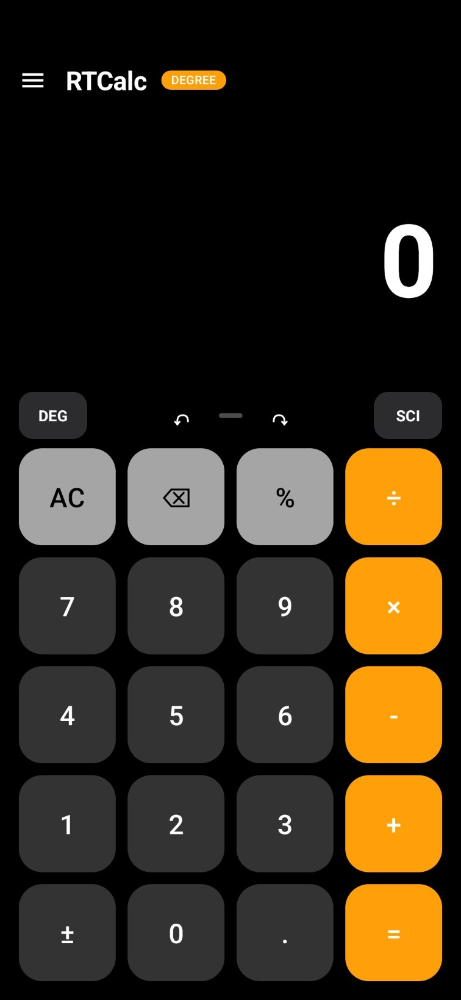
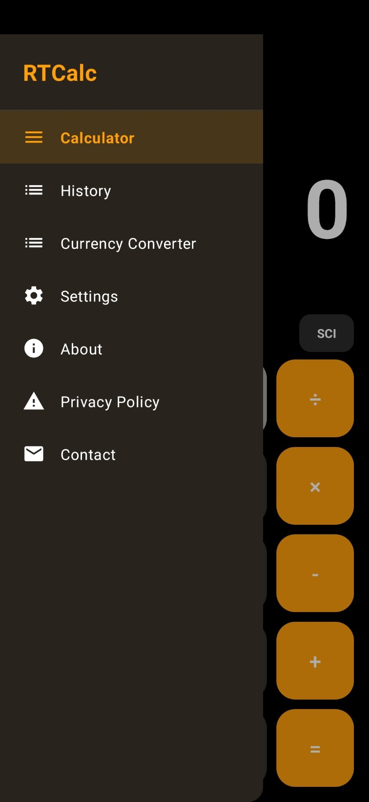
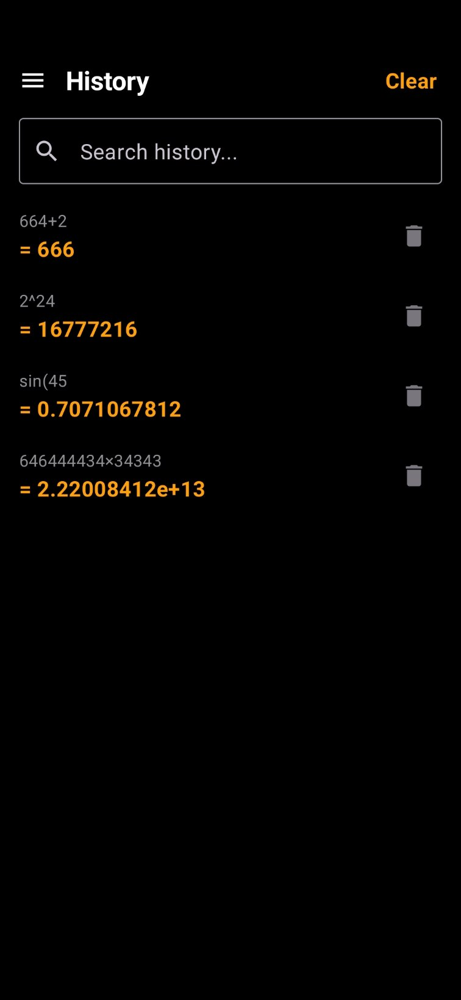
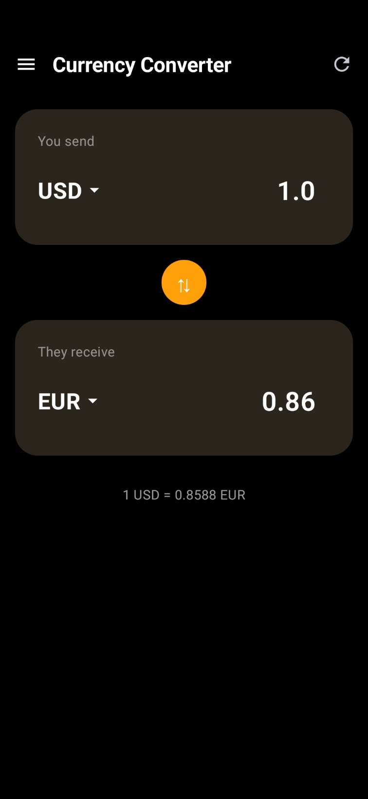
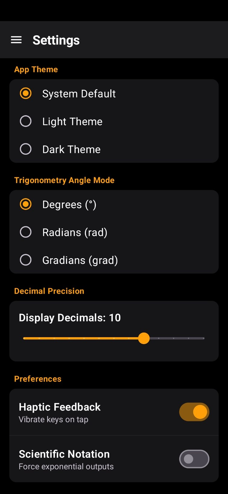

# RTCalc

A complete, production-ready scientific calculator and currency converter for Android.

## Screenshots

<div align="center">
  
  
  
  
  
</div>

## Features

✓ Standard Calculator
✓ Scientific Calculator
✓ Expression Editor
✓ History
✓ Currency Converter
✓ NPR Support
✓ Real-time Exchange Rates
✓ Undo / Redo
✓ Copy / Paste
✓ DEG / RAD
✓ Dark Theme
✓ Light Theme

## Navigation

RTCalc features a clean, unified interface where the Calculator is always the primary display. Secondary features and tools are neatly organized inside the top-left Hamburger menu, maximizing your calculation workspace.

## Installation

1. Clone the repository.
2. Open the project in Android Studio.
3. Sync project with Gradle files.
4. Build and run the `app` module on an emulator or physical device running Android 8.0 (API 26) or above.

## Build Instructions

To build a release APK from the command line:

```bash
./gradlew assembleRelease
```

## Contact

**Developer:** Ritik Thakur
**Email:** ritikthakur@duck.com

## License

This project is intended for personal and educational use. All rights reserved.
